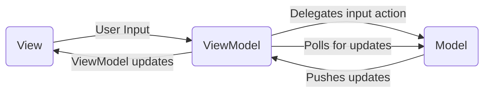

# Conway's Game of Life in JavaFX

This project is an implementation of Conway's Game of Life using JavaFX. It follows the MVVM (Model-View-ViewModel) architecture pattern to separate the concerns of the application.

## Features

- **Interactive Simulation**: Draw and erase cells on the board to set up initial states.
- **Simulation Control**: Start, stop, and step through the simulation.
- **Responsive UI**: The application interface is built with JavaFX, providing a smooth and interactive user experience.

## Architecture

The project is structured using the MVVM architecture pattern:


**Components**
- **Model**: Contains the core logic of the Game of Life, including the board and cell states.
- **ViewModel(s)**: Acts as an intermediary between the View and the Model, handling user input and updating the View.
- **View**: The JavaFX UI components that display the board and controls.


### Building and Running

**Clone the repository**:
```
git clone https://github.com/VAlexandersson/GameOfLifeSimulator.git
cd GameOfLifeSimulator
```

**Build the project using Maven**:
```
mvn clean install
```

**Run the application**:
```
mvn javafx:run
```

### Usage
- **Draw Mode**: Press the "Draw" button to enable drawing cells.
- **Erase Mode**: Press the "Erase" button to enable erasing cells.
- **Start Simulation**: Press the "Start" button to begin the simulation.
- **Stop Simulation**: Press the "Stop" button to pause the simulation.
- **Step Simulation**: Press the "Step" button to advance the simulation by one step.
- **Reset**: Press the "Reset" button to clear the board and reset the state.


